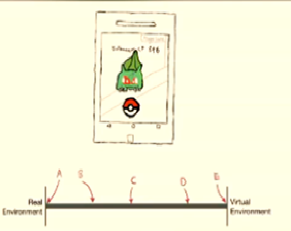
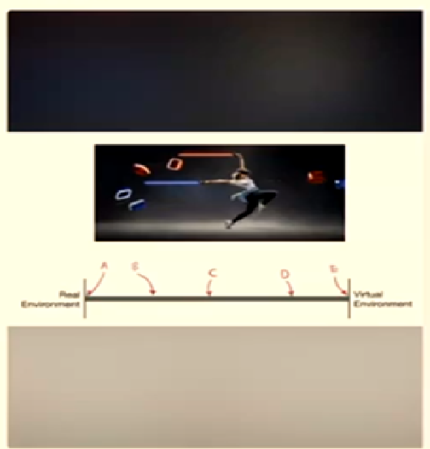
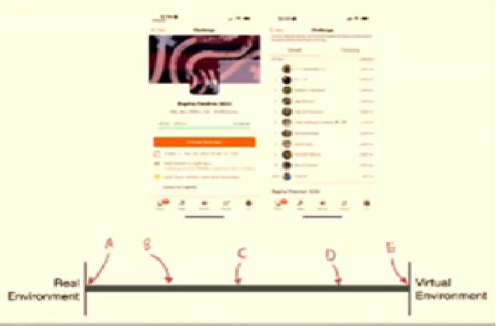

Q: VR was invented in the 21st century (2001 – 2100)

A: False

Q: Which device sparked the current (21st Century) rise of VR?

A: Oculus Rift DK1

Q: What should Pokémon GO be placed on RV Continuum
Picture

A: B

Q: Where should beat Saber be placed on the RV Continuum
Picture 

A: E

Q: Where should Strava be placed on the RV Continuum
Picture 
 

A: B

Q: Why is Strava not considered to be near the extreme end of “Real Environment” in the RV Spectrum?

A: It has some “Extent of World Knowledge”

Q: What is the common public perception of the difference between AR & <R?

A: Virtual Entities in MR can interact with real-world objects

Q: The 3D Models are extremely high quality. What dimensions of the RV Continuum is this referring to?

A: Reproduction Fidelity

Q: The 3D Virtual dogs are able to jump onto the real table seen through the camera.
What dimension of the RV continuum is this referring to?

A: Extent of World Knowledge

Q: The stereo optics provide a perception of depth through an LCD display
What dimension of the RB continuum is this referring to?

A:  Extent of Presence Metaphor

Q: for a moment I believed that I was actually 1000ft above ground
What dimensions of the RV continuum is this referring to?

A: Coherence
