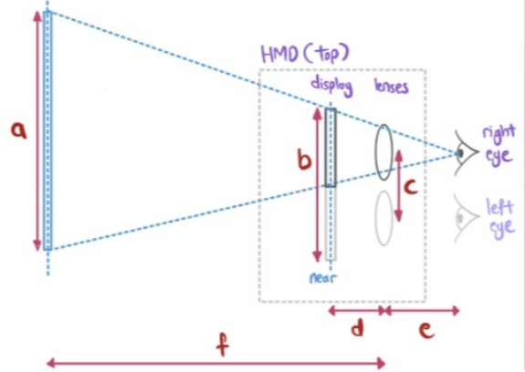

# DIA_Notes
## Week 1
VR, AR, MR and XR
- Virtual Reality (VR)
- Augmented Reality (AR)
- Mixed Reality (MR)
- Extended Reality (XR)


Reality-Virtuality(RV) Continuum
- Extent of World Knowledge
  - Refers to how much knowledge the system has about the physical or virtual environment.
  - Examples:
    - A basic AR app that overlays graphics without understanding the 3D space (low extent of world knowledge).
    - A sophisticated MR system with real-time spatial mapping, like Microsoft HoloLens, which recognizes surfaces, distances, and objects (high extent of world knowledge).
- Reproduction Fidelity
  - Refers to how accurately the system replicates sensory input to represent the real or virtual world.
  - Examples:
    - Low fidelity: Pixelated graphics, flat audio, and no tactile feedback.
    - High fidelity: 4K resolution, spatial audio, and precise haptics.
- Extent of Presence Metaphor
  - Refers to how the system supports a user's sense of presence by integrating natural and intuitive interactions or metaphors that align with the real world.
  - Examples:
    - Low extent: Systems where users rely on abstract or non-intuitive inputs (e.g., pressing buttons on a keyboard to navigate).
    - High extent: Systems using natural metaphors, like VR gloves to pick up virtual objects or walking in place to move in VR.
- Coherence
  - Refers to the consistency and logical integration of elements within the virtual or augmented environment.
  - Examples
    - Low coherence: Inconsistent lighting, objects behaving unrealistically (e.g., passing through walls).
    - High coherence: Realistic physics, seamless integration of virtual objects into the real world in AR, or logical narrative and rules in VR.

The Concept of Presence
- Place illusion
  - "The objects in the (virtual) room feels like they are really here. I even bumped into the wall in my real room because I lost track of my actual surroundings"
- Plausibility illusion
  - “I immediately duck as it really felt like I was in danger when the enemies attacked me, even though I knew it was just a game. I mean the graphics aren't even realistic."

Some history trivia stuff
- VR was invented in the 21st Century - False
- Which device sparked the current rise of VR - Oculus Rift DK1
  
### Questions
What is the common public perception of the difference between AR and MR
- They are the same
- AR refers to blending virtual objects into the real-world
- Virtual entities in MR can interact with real-world objects :heavy_check_mark:

"The 3D models are extremely high quality." What dimension of the RV continuum is this referring to?
- Extent of World Knowledge
- Reproduction Fidelity :heavy_check_mark:
- Extent of Presence Metaphor
- Coherence

"3D virtual dogs are able to jump onto real table seen through the camera." What dimension of the RV continuum is this referring to?
- Extent of World Knowledge :heavy_check_mark:
- Reproduction Fidelity
- Extent of Presence Metaphor
- Coherence

"Stereo optics provide a perception of depth through an LCD display" What dimension of the RV continuum is this referring to?
- Extent of World Knowledge
- Reproduction Fidelity
- Extent of Presence Metaphor :heavy_check_mark:
- Coherence

"For a moment i believed that I was actually 1k ft above ground"What dimension of the RV continuum is this referring to?
- Extent of World Knowledge
- Reproduction Fidelity
- Extent of Presence Metaphor
- Coherence :heavy_check_mark:

## Week 2

Key Dimensions of Presence, Flow, and Cybersickness
- Presence:
  - The psychological sense of "being there" in a virtual or augmented environment.
  - Key Factors: Realism, interactivity, and user attention contribute to a higher sense of presence.
- Flow:
  - The mental state of being fully absorbed and engaged in an activity, often described as "being in the zone."
  - A balance between challenge and skill, clear goals, and immediate feedback.
- Cybersickness:
  - A form of motion sickness caused by discrepancies between visual input and physical sensation.
  - Symptoms: Nausea, dizziness, and fatigue.
  - Causes: Lag in system response, mismatched field of view, or unnatural motion cues.

The Role of Affordances in Immersive Experiences
- Definition: Affordances are the perceived possibilities for action provided by an object or environment.
- In Immersive Experiences:
  - Interaction Design: Users should easily understand how to interact with virtual objects (e.g., pulling a lever in VR that behaves like a real-world lever).
  - Intuitive Interfaces: The environment should leverage natural gestures and behaviors to enhance immersion.
  - Enhancing Engagement: By designing affordances that align with user expectations, the experience feels more intuitive and immersive (e.g., walking naturally to move in VR).

Types of Qustionnaires
- SSQ: Simulator Sickness Questionnaire
- CSQ: Cybersickness Questionnaire
- VRSQ: Virtual Reality Sickness Questionnaire


### Questions
Which of the following describes immersion from a systems perspective?
- Wide FOV :heavy_check_mark:
- Higher spatial presence
- Higher place illusion
- 8K Resolution display :heavy_check_mark:
- Lower cybersickness
- 6-DOF inside-out tracking :heavy_check_mark:

Which of the following describes immersion from an experiential perspective?
- Wide FOV
- Higher spatial presence :heavy_check_mark:
- Higher place illusion :heavy_check_mark:
- 8K Resolution display
- Lower cybersickness :heavy_check_mark:
- 6-DOF inside-out tracking

What experiential constructs were analysed in the user study in the paper on Exploring Gameplay Experiences on the Oculus Rift"?
- Flow :heavy_check_mark:
- Presence
- Place illusion
- Plausibility illusion
- Cybersickness :heavy_check_mark:

What quantitative data was analysed in the user study in the paper on "Exploring Gameplay Experiences on the Oculus Rift"?
- Flow :heavy_check_mark:
- Presence
- Physiological measures :heavy_check_mark:
- User behaviors
- Cybersickness

What quantitative data was analysed in the user study in the paper on "Understanding User Experiences Across VR Walking-in-place Locomotion Methods"?
- Flow :heavy_check_mark:
- Presence :heavy_check_mark:
- Physiological measures
- User behaviors
- Cybersickness :heavy_check_mark:

What qualitative data was analysed in the user study in the paper on "Understanding User Experiences Across VR Walking-in-place Locomotion Methods"?
- Flow :heavy_check_mark:
- Presence :heavy_check_mark:
- Physiological measures
- User behaviors :heavy_check_mark:
- Cybersickness :heavy_check_mark:

What is/are the best type(s) of data to answer this research question?
Is the VR version more immersive than the desktop version of myApp?
- Observations
- Think-aloud during the experience
- Validated Questionnaires :heavy_check_mark:
- Post-experience interviews
- Physiological sensing
- Telemetry

What are the appropriate type of data to answer this research question?
What user experiences does the VR classroom intervention afford during the class?
- Observations :heavy_check_mark:
- Think-aloud during the experience :heavy_check_mark:
- Validated Questionnaires
- Post-experience interviews :heavy_check_mark:
- Physiological sensing
- Telemetry

Which of the following is NOT a symptom of a cybersickness?
- Blurred vision
- Eyestrain
- Giddiness
- Loss of self-consciousness :heavy_check_mark:
- Vertigo

"This one feels dizzier than the previous one. " - What dimension of cybersickness is this?
- Disorientation :heavy_check_mark:
- Nausea
- Oculomotor
- Involvement
- Realness

"I find it very straining on my eyes to look at stuff in the scene after a short while" - What imension of cybersickness is this?
- Disorientation
- Nausea
- Oculomotor :heavy_check_mark:
- Involvement
- Realness

Which cybersickness questionnaire is best when I need to use the results to inform v2.0 development of my VR application?
- SSQ
- VRSQ/CSQ :heavy_check_mark:

Which cybersickness questionnaire should I use when I need to compare my results with a pool of prior research studies from others?
- SSQ :heavy_check_mark:
- CSQ
- VRSQ

What is the type of experience being described here? 
"head knocked into real wall while avoiding the virtual wall"
- Presence :heavy_check_mark:
- Flow
- Cybersickness

"too immersed into the game to be unaware of how I actually looked"
- Presence
- Flow :heavy_check_mark:
- Cybersickness

What is the main affordance on a haptic glove for an experienced VR user?
- Reach out to touch things in virtual environment :heavy_check_mark:
- Pick up VR controller to interact with virtual environment
- Wave hand in air
- Hug another character in virtual environment

## Week 3

Engines info


Standards


### Questions
When I run console.log("debug"), where can I see this "debug" message?
- Mac Terminal :heavy_check_mark:
- Windows Commmand Prompt :heavy_check_mark:
- Web browser's JavaScript Console :heavy_check_mark:
- ADB's logcat

You are building a VR application that includes a novel interaction not found in current VR applications. Your lab has funding o obtain resources deemed necessary for development. Which tool(s) can likely be used for you to base your development on?
- Unity
- OpenXR SDK in C++ :heavy_check_mark:
- Babylon.js
- Cospaces
- Blender

You are building a web-based VR experience and you want to focus on implementing the VR components. You need a modern open tandard with a vibrant developer ecosystem that constantly updates the underlying tooling. What standard should you ideally target?
- OpenXR
- WebXR :heavy_check_mark:
- WebGL
- OpenGL
- OpenCL
- Vulkan

In your VR app, realistic graphics is the most important and you need to have fine-grained control of GPU resources. You need an open standard with a robust community that actively maintains the underlying tooling. What standard hould you ideally target?
- OpenXR
- WebXR
- WebGL
- OpenGL
- OpenCL
- Vulkan :heavy_check_mark:

What is the most accessible tool for developers without coding experience?
- Babylon.js
- CoSpaces :heavy_check_mark:
- Unity
- OpenXR SDK in C++
- Unreal Engine

What is/are the key advantages of building a WebXR app?
- Easily accessible XR apps for public :heavy_check_mark:
- Consistently strong developer community support :heavy_check_mark:
- Easily accessible development tools for developers :heavy_check_mark:
- Able to exploit hardware addvancement in the latest XR devices
- Easily create highly performant experiences native to different XR devices

WebXR is an open-source 3D engine for building web-based XR applications
- True
- False :heavy_check_mark:

Babylon.js is an open standard for programming web-based XR applications
- True
- False :heavy_check_mark:

Unity Engine can be used to build web-based XR applications
- True :heavy_check_mark:
- False

Babylon.js can be used to build web-based AR applications
- True :heavy_check_mark:
- False 

WebXR is only meant for building desktop 3D web application
- True
- False :heavy_check_mark:

## Week 4

### Quiz Questions
1: Rank the tools from most accessible (dev w/o doign exp) to least
- 1 - Cospaces
- 2 - Unity
- 3 - OpenXR SDK in C++

2: Need to implement cross-platform native VR exp using novel hand tracking algo and want to focus on implementing VR components with teh same underlying code-base across Meta's Quest HMDs... What standard should you be targetting?
- OpenCL
- Vulkan
- OpenXR :heavy_check_mark:
- WebXR
- OpenGL
- WebGL

3: Introduced a new "/components" directory containing new source files that are part of your Babylon.js proj. Which file to modify to make sure web app still runs?
- app.ts
- package-lock.json
- tsconfig.json :heavy_check_mark:
- main.ts
- index.html
- package.json

4: WebXR typescript-based app, edited a file in proj directory to specify that the Babylon.js version should be 7.3.0. 
After running 'npm install', a file will be auto updated in proj directory. What file is that?
- package-lock.json

5: 
```js
import { Engine, Scene } from "@babylonjs/core";
class App 
{
    private engine: Engine;
    constructor(engine: Engine) {this.engine = engine;}
    createScene() 
    {
        const scene = new Scene(this.engine);
        scene.createDefaultCamera(true, true, true);
        scene.createDefaultLight(true);
        return scene;
    }
}

const canvas = <HTMLCanvasElement>document.getElementById('renderCanvas');
const engine = new Engine(canvas, true);
const app = new App(engine);
app.createScene().then(scene => {
        engine.runRenderLoop(() => {
            scene.render();
        })
    });
```

'app.createScene().then' is undefined
- Missing keyword = async

6: Want to deploy Babylon.js application to a web server, what to run in terminal to reploy?
- npm run preview
- npm run vite
- npm run test
- npm run build :heavy_check_mark:
- npm run dev

7: Where is createScene(...) normally defined?
- package.json
- tsconfig.json
- index.html
- app.ts :heavy_check_mark:
- package-lock.json

8: Which file to add to team's version control if you want the project dependencies to have the same exact versions across your team?
- index.html
- app.ts
- package.json
- tsconfig.json
- package-lock.json :heavy_check_mark:

9: You want to add custom script as part of BabylonJS proj test workflow, which file to modify?
- index.html
- package.json :heavy_check_mark:
- app.ts
- package-lock.json
- tsconfig.json

10: When connecting to Meta Quest 2, no prompt to enable connection and cannot see dev options in settings, what is the likely issue?
- Headset is in low power mode
- Did not tap the Build Number 7 times in settings
- Did not connect a USB data cable from PC to headset
- Did not enable Developer Mode on Meta Horizon app on phone :heavy_check_mark:

11: What does the following Babylon.js snippet accomplish
```js
const xr = await scene.createDefaultXRExperienceAsync({
    uiOptions:{
        sessionMode: "immersice-vr",
        },
    });
```

- Creates a default BabylonJS scene with a sphere and plane, and then initializes typical components for VR experiences.
- Initializes typical components for hybrid XR (Ar & VR) exp
- Makes a non-blocking method call to initialize typical components for VR experiences. :heavy_check_mark:
- Creates a default BabylonJS scene with a sphere and plane.

## Week 5 - Hardware & Software Components
**Eye relief**: the distance from the last surface of an eyepiece within which the user's eye can obtain the full viewing angle.

**Focal length**: the distance between a lens and its focal point.

### Questions
What is the main difference between the hardware in a modern smartphone and a HMD?
- Display
- Magnifier lens :heavy_check_mark:
- CPU
- GPU
- Cameras
- Motion sensors

Image for next 2 questions below



In the schematic HMD diagram, where is the "eye relief"? 
- e

In the schematic HMD diagram, where is the width of the virtual image? 
- a

In HMDs, what effect will changing the focal length of the lens have?
- Height of HMD display
- Depth of HMD display
- Depth of the view of frustrum's near plane
- Depth of the virtual image generated :heavy_check_mark:

The perspective/view matrix for rendering in HMDs is the same for both eyes. 
- False

What is a valid property of the view frustum generated by typical HMDs?
- Vol is vertically symmetric only :heavy_check_mark:
- Vol is horizontally symmetric only
- Vol is both vertically and horizontally symmetric
- There is no symmetry in the vol

What is the result of reducing the eye relief?
- Increased dist b/w lens to virtual image
- Decreased dist b/w lens to virtual image
- Increased FOV :heavy_check_mark:
- Decreased FOV

Which object is easier for the user to reach out and grab with his/her hands?


- A

VR application for caregivers to empathise with patients suffering from dementia, which software component is least impt?
- Rendering
- Physics :heavy_check_mark:
- Input Handler
- Audio

What is your top reason for using ECS over straightforward OOP in your game app architecture?
- There are lots of varied virtual objects dynamically created at runtime :heavy_check_mark:
- ECS has much better performance
- Features in each entity need to constantly share info
- Diff virtual entities have vastly diff features
- All virtual objs can be constructed when the app starts


## IPA 1 Stuff

Note: Remember to import libraries for the items
Example:


**Creating scene**
```js
const scene = new Scene(this.engine);
```

**Creating camera**
- Link: https://doc.babylonjs.com/features/featuresDeepDive/cameras
- Types of camera
  - Universal Camera 
    - FPS Cam
  - Arc Rotate Camera 
    - Orbitting cam that always point to target position
  - Follow Camera
    - Takes a mesh as target and follows it as it moves
  - Anaglyph Camera
    - Universal + Arc Rotate for use with Red & Cyan 3D glasses
  - Device Orientation Camera
    - React to device being tilted forward, backward, left or right
  - Virtual Joysticks Camera
    - On Screen 2D graphics to control camera or other scene items
  - Virtual Reality camera
    - Range of camera for VR devices
```js
const camera = new UniversalCamera("MainCamera", new Vector3(0,0,0), scene);
```

**Creating lights**
- Link: https://doc.babylonjs.com/features/featuresDeepDive/lights
- Types of Lights
  - Point light
  - Directional light
  - Spot light
  - Hemispheric light (Ambient light)
  - Rectangular area light (LED Panel)
```js
const light = new DirectionalLight("MainSceneLight", new Vector3(0, 100, 0), scene);
```

**Creating meshes**
- Link: https://doc.babylonjs.com/features/featuresDeepDive/mesh/creation/
```js
const mesh = MeshBuilder.CreateBox("BoxMesh", {size: 5}, scene);
```

**Functions & Debug text**
```js
export function createHelloMessage(_inputStr: string)
{
    return `Hello, ${_inputStr}!`;
}

export function sayHello(_inputStr:string)
{
    console.log(createHelloMessage(_inputStr));
}
```